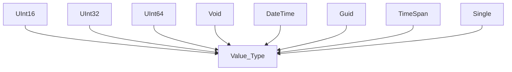

# Learning C# and Object Oriented Programming
Table of Contents:
1. The anatomy of a simple C# program
2. System Data Types and corresponding C# Keywords
3. How to find default and Min/Max Values of C# Types
4. The Data Type Class Hierarchy

<details>
<summary>

## The anatomy of a simple C# program
</summary>
<p>
C# demands that all program logic be contained within a type definition. (type is a general term referring to a member of the set, class, interface, structure, enumeration, delegate).

Unlike many other languages, in C#, it is not possible to craete global functions or global points of data. Rather, all data members and all methods must be contained within a type definition.

<quote>**Note:** C# is a case-sensitive programming language. Therefore, Main is not the same as main, and Readline is not the same as Readline.

Be aware that all C# keywords are lowercase, e.g., public, lock, class, dynamic while namespaces, types and member names begin (by convention) with initial Capital latter and have capitalized the first letter of any embedded words, e.g., Console.WriteLine, System.Windows, MessageBox, System.Data.SqlClient.
</quote>

<quote>**Sample C# Method**

```csharp
class Program
{
    static void Main(string[] args)
    {
        //Comment
        Console.WriteLine($"This is my first line of code");
        Console.ReadLine();
    }
}
```
</p>
</details>

<details>
<summary>

## System Data Types and corresponding C# Keywords
</summary>
<p>

| C# Shorthand | CLS Compliant | System Type | Range | Meaning in Life |
| -- | -- | -- | -- | -- |
| bool | Yes | Boolean | true or false | Represents truth or falsity |
| sbyte | No | SByte | -128 to 127 | Signed 8-bit number |
| byte | Yes | Byte | 0 to 255 | Unsigned 8-bit number | 
| short | Yes | Int16 | -35768 to 32767 | Signed 16-bit number |
| ushort | No | UInt16 | 0 to 65535 | Unsigned 16-bit number |
| int | Yes | Int32 | -2.147.483.648 to 2.147.483.647 | Signed 32-bit number |
| uint | No | UInt32 | 0 to 4.294.967.295 | Unsigned 32-bit number |
| long | Yes | Int64 | -9.223.372.036.854.755.808 to 9.223.372.036.854.755.807 | Signed 64-bit number |
| ulong | No | UInt64 | 0 to 18.446.744.073.709.551.615 | Unsigned 64-bit number |
| char | Yes | Char | U+0000 to U+ffff | Single 16-bit Unicode character |
| float | Yes | Single | -3.4 10<sup>38</sup> to 3.4 10<sup>38</sup> | 32-bit floating-point number |
| double | Yes | Double | +/- 5.0 10<sup>-324</sup> to +/-1.7 10<sup>308</sup> | 64-bit floating-point number |
| decimal | Yes | Decimal | (-7.9 x 10<sup>28</sup> to 7.9 x 10<sup>28</sup>/10<sup>0 to 28</sup> | 128-bit signed number)
| string | Yes | String | Limited by system memory | Represents a set of Unicode characters |
| object | Yes | Object | Can store any data type in an object variable | The base class of all types in .Net universe
</p>    
</details>

<details>
<summary>

## How to find default and Min/Max Values of C# Types
</summary>
<p>

```csharp
//Min & Max Value of Numeric Types:

Console.WriteLine($"sbyte, Min: {sbyte.MinValue}, Max: {sbyte.MaxValue}");
Console.WriteLine($"byte, Min: {byte.MinValue}, Max: {byte.MaxValue}");
Console.WriteLine($"short, Min: {short.MinValue}, Max: {short.MaxValue}");
Console.WriteLine($"ushort, Min: {ushort.MinValue}, Max: {ushort.MaxValue}");
Console.WriteLine($"int, Min: {int.MinValue}, Max: {int.MaxValue}");
Console.WriteLine($"uint, Min: {int.MinValue}, Max: {int.MaxValue}");
Console.WriteLine($"long, Min: {long.MinValue}, Max: {long.MaxValue}");
Console.WriteLine($"ulong, Min: {ulong.MinValue}, Max: {ulong.MaxValue}");
Console.WriteLine($"float, Min: {float.MinValue}, Max: {float.MaxValue}");
Console.WriteLine($"double, Min: {double.MinValue}, Max: {double.MaxValue}");
Console.WriteLine($"decimal, Min: {decimal.MinValue}, Max: {decimal.MaxValue}");
Console.WriteLine($"double: Negative Infinity: {double.NegativeInfinity}, Positive Infinity: {double.PositiveInfinity}");
```

The following table shows the default values of C# types:

| Type | Default Value |
| -- | -- |
| Any reference type  | null |
| Any  | built-in integral numeric type	0 (zero) |
| Any  | built-in floating-point numeric type	0 (zero) |
| bool | false |
| char  | '\0' (U+0000) |
| enum | value produced by the expression (E)0, where E is the enum identifier. |
| struct | The value produced by setting all value-type fields to their default values and all reference-type fields to null. |
| Any nullable value type | An instance for which the HasValue property is false and the Value property is undefined. That default value is also known as the null value of a nullable value type. |


```csharp
int x = default;
Console.WriteLine($"Default value of x: {x}"); // 0
```

**Note:** 
1. Be aware that it is a compiler error to make use of a local variable before assigning an initial value. It is good practice to assign an initial value to your local data points at the time of declaration.
2. Since 7.1, the default literal assigns a variable the default value for its data type. This works for standard data types as well as custom classes and generic types.
3. All intrinsic data types support what is known as a default constructor. This feature allows you to create a variable using the new keyword, which automatically sets the variable to its default value;
    - bool variables are set to false
    - Numeric data is set to 0/0.0
    - char variables are set to single empty character
    - BigInteger variables are set to 0
    - DateTime variables are set to 1/1/0001 12:00:00 AM
    - Object references (including strings) are set to null
</p>    
</details>

<details>
<summary>

## The Data Type Class Hierarchy
</summary>
<p>


</p>
</details>