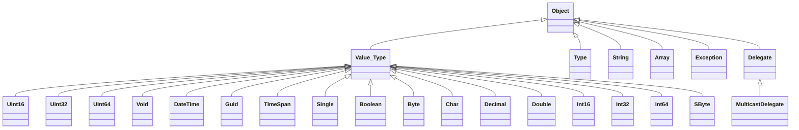

# Learning C# and Object Oriented Programming
Table of Contents:
1. The anatomy of a simple C# program
2. System Data Types and corresponding C# Keywords
3. How to find default and Min/Max Values of C# Types
4. The Data Type Class Hierarchy
5. Parsing Values and Using TryParse from String Data
6. Working with String Data
7. String Interpolation and Escape Characters, Verbatim Strings

<details>
<summary>

## 1. The anatomy of a simple C# program
</summary>
<p>
C# demands that all program logic be contained within a type definition. (type is a general term referring to a member of the set, class, interface, structure, enumeration, delegate).

Unlike many other languages, in C#, it is not possible to craete global functions or global points of data. Rather, all data members and all methods must be contained within a type definition.

<quote>**Note:** C# is a case-sensitive programming language. Therefore, Main is not the same as main, and Readline is not the same as Readline.

Be aware that all C# keywords are lowercase, e.g., public, lock, class, dynamic while namespaces, types and member names begin (by convention) with initial Capital latter and have capitalized the first letter of any embedded words, e.g., Console.WriteLine, System.Windows, MessageBox, System.Data.SqlClient.
</quote>

<quote>**Sample C# Method**

```csharp
class Program
{
    static void Main(string[] args)
    {
        //Comment
        Console.WriteLine($"This is my first line of code");
        Console.ReadLine();
    }
}
```
</p>
</details>

<details>
<summary>

## 2. System Data Types and corresponding C# Keywords
</summary>
<p>

| C# Shorthand | CLS Compliant | System Type | Range | Meaning in Life |
| -- | -- | -- | -- | -- |
| bool | Yes | Boolean | true or false | Represents truth or falsity |
| sbyte | No | SByte | -128 to 127 | Signed 8-bit number |
| byte | Yes | Byte | 0 to 255 | Unsigned 8-bit number | 
| short | Yes | Int16 | -35768 to 32767 | Signed 16-bit number |
| ushort | No | UInt16 | 0 to 65535 | Unsigned 16-bit number |
| int | Yes | Int32 | -2.147.483.648 to 2.147.483.647 | Signed 32-bit number |
| uint | No | UInt32 | 0 to 4.294.967.295 | Unsigned 32-bit number |
| long | Yes | Int64 | -9.223.372.036.854.755.808 to 9.223.372.036.854.755.807 | Signed 64-bit number |
| ulong | No | UInt64 | 0 to 18.446.744.073.709.551.615 | Unsigned 64-bit number |
| char | Yes | Char | U+0000 to U+ffff | Single 16-bit Unicode character |
| float | Yes | Single | -3.4 10<sup>38</sup> to 3.4 10<sup>38</sup> | 32-bit floating-point number |
| double | Yes | Double | +/- 5.0 10<sup>-324</sup> to +/-1.7 10<sup>308</sup> | 64-bit floating-point number |
| decimal | Yes | Decimal | (-7.9 x 10<sup>28</sup> to 7.9 x 10<sup>28</sup>/10<sup>0 to 28</sup> | 128-bit signed number)
| string | Yes | String | Limited by system memory | Represents a set of Unicode characters |
| object | Yes | Object | Can store any data type in an object variable | The base class of all types in .Net universe
</p>    
</details>

<details>
<summary>

## 3. How to find default and Min/Max Values of C# Types
</summary>
<p>

```csharp
//Min & Max Value of Numeric Types:

Console.WriteLine($"sbyte, Min: {sbyte.MinValue}, Max: {sbyte.MaxValue}");
Console.WriteLine($"byte, Min: {byte.MinValue}, Max: {byte.MaxValue}");
Console.WriteLine($"short, Min: {short.MinValue}, Max: {short.MaxValue}");
Console.WriteLine($"ushort, Min: {ushort.MinValue}, Max: {ushort.MaxValue}");
Console.WriteLine($"int, Min: {int.MinValue}, Max: {int.MaxValue}");
Console.WriteLine($"uint, Min: {int.MinValue}, Max: {int.MaxValue}");
Console.WriteLine($"long, Min: {long.MinValue}, Max: {long.MaxValue}");
Console.WriteLine($"ulong, Min: {ulong.MinValue}, Max: {ulong.MaxValue}");
Console.WriteLine($"float, Min: {float.MinValue}, Max: {float.MaxValue}");
Console.WriteLine($"double, Min: {double.MinValue}, Max: {double.MaxValue}");
Console.WriteLine($"decimal, Min: {decimal.MinValue}, Max: {decimal.MaxValue}");
Console.WriteLine($"double: Negative Infinity: {double.NegativeInfinity}, Positive Infinity: {double.PositiveInfinity}");
```

The following table shows the default values of C# types:

| Type | Default Value |
| -- | -- |
| Any reference type  | null |
| Any  | built-in integral numeric type	0 (zero) |
| Any  | built-in floating-point numeric type	0 (zero) |
| bool | false |
| char  | '\0' (U+0000) |
| enum | value produced by the expression (E)0, where E is the enum identifier. |
| struct | The value produced by setting all value-type fields to their default values and all reference-type fields to null. |
| Any nullable value type | An instance for which the HasValue property is false and the Value property is undefined. That default value is also known as the null value of a nullable value type. |


```csharp
int x = default;
Console.WriteLine($"Default value of x: {x}"); // 0
```

**Note:** 
1. Be aware that it is a compiler error to make use of a local variable before assigning an initial value. It is good practice to assign an initial value to your local data points at the time of declaration.
2. Since 7.1, the default literal assigns a variable the default value for its data type. This works for standard data types as well as custom classes and generic types.
3. All intrinsic data types support what is known as a default constructor. This feature allows you to create a variable using the new keyword, which automatically sets the variable to its default value;
    - bool variables are set to false
    - Numeric data is set to 0/0.0
    - char variables are set to single empty character
    - BigInteger variables are set to 0
    - DateTime variables are set to 1/1/0001 12:00:00 AM
    - Object references (including strings) are set to null
</p>    
</details>

<details>
<summary>

## 4. The Data Type Class Hierarchy
</summary>
<p>

**Notes:**
- Each type ultimately derives from System.Object which defines a set of methods (e.g., ToString(), Equals(), GetHashCode()) common to all types in the .Net Core base class libraries.
- Many numerical data types derives from a class named System.ValueTypes.
- ValueTypes are automatically allocated on the Stack.
- Types that do not have System.ValueType in their inheritance chain (such as System.Type, System.String, System.Array, System.Exception and System.Delegate) are not allocated on the stack but on the garbage-collected heap.


</p>
</details>

<details>
<summary>

## 5. Parsing Values and Using TryParse from String Data
</summary>
<p>
- The .Net Core data types provide the ability to generate a variable of their underlying type given a textual equivalent by parsing.

```csharp
string vInt = "1055";
string vBool = "false";
string vDouble = "99,456498";

Console.WriteLine($"Value in int: {int.Parse(vInt)}");
Console.WriteLine($"Value in bool: {bool.Parse(vBool)}");
Console.WriteLine($"Value in double: {double.Parse(vDouble)}");
```

- One issue with the preceding code is that an exception will be thrown if the string cannot be cleanly converted to the correct data type. 

For example:
```csharp
bool b = bool.Parse("Hello");
```

The TryParse() statement takes an out parameter and returns bool if the parsing is successful. 

For Example:
```csharp
if (bool.TryParse("Hello", out bool b))
    Console.WriteLine($"Value of b: {b}");
else
    Console.WriteLine("Hello cannot be converted to boolean");
```
</p>
</details>


<details>
<summary>

## 6. Working with String Data
</summary>
<p>

System.String provides a number of method you would expect from such a utility class, including methods that return the length of the character data.

| String Member | Meaning in Life |
| -- | -- |
| Length | This property returns the length of the current string.|
| Compare | This static method compares two strings.|
| Contains | This method determines whether a string contains a specific substring.|
| Equals | The method tests whether two string objects contain identical character data|
| Format | This static method formats a string using other primitives.|
| Insert | This method inserts a string within a given string.|
| PadLeft / PadRight| This methods are used to pad a string with some characters.|
| Remove / Replace | These methods are used to receive a copy of a string with modifications.|
| Split | The method returns a String Array containing the substrings in this instance that are delimited by elements of a specified char array or string array.|
| Trim | The method removes all occurrences of a set of specified characters from the beginning and end of the current string.|
| ToUpper / ToLower |  These methods create a copy of the current string in uppercase or lowercase format, respectively.|

Examples:
```csharp
string vString = "One of the most important days of the century.";
string vString2 = "One of the most important days of the century";

//Length

//46
Console.WriteLine($"Length of the string is: {vString.Length}");
//1 - > Not Identical, vString is longer than vString2.
Console.WriteLine($"Comparison of vString and vString2: {string.Compare(vString, vString2)}");
//-1 - > Not Identical, vString2 is shorted than vString. 
Console.WriteLine($"Comparison of vString2 and vString: {string.Compare(vString2, vString)}");
//0 - > Identical
Console.WriteLine($"Comparison of vstring and vString: {string.Compare(vString, vString)}"); 
//1 - > Not Identical, vString is longer than vString2.
Console.WriteLine($"Comparison of vString and vString2: {vString.CompareTo(vString2)}"); 
```
</p>
</summary>
</details>

<details>
<summary>

## 7. String Interpolation and Escape Characters, Verbatim Strings
</summary>
<p>

| Character | Meaning in Life |
| -- | -- |
| \' | Inserts a single quote into a string literal |
| \" | Inserts a double quote into a string literal |
| \\ | Inserts a backslash into a string literal. This can be quite helpful when defining file or network paths. |
| \a | Triggers a system alert |
| \n | Inserts a new line |
| \r | Inserts a carriage return |
| \t | Inserts a horizontal tab into the string literal |

## String Interpolation

1. String.Format can be used for String Interpolation.

Example: 
```csharp
int age = 4;
string name = "Seha";
string greeting = string.Format("Hello {0} you are {1} years old.", name, age);
```

2. $ sign can be used for String Interpolation.

Example:
```csharp
int age = 4;
string name = "Seha";
string greeting = $"Hello {name} you are {age} year old.";
```
</p>
</details>

## Verbatim Strings

When you prefix a string literal with the @ symbol, you have created what is termed a **verbatim string**. 

Using verbatim strings, you disable the processing of a literal's escape characters and print out a string as is. This can be most useful when working with strings representing directory and network paths.

Example: 
```csharp
Console.WriteLine(@"C:\MyApp\Seha\Executable.exe");
string myLongString = @"This is a very 
    very long
        string that I can give you an example of.";

Console.WriteLine(myLongString);
```

Verbatim string can also be interpolated string, by specifying both the interpolation operator ($) and the verbatim operator (@).

Example: 
```csharp
string interp = "interpolation";
string myLongString2 = $@"This is a very 
    very 
        long string with {interp}";
```

## Strings and Equality
The C# equality operators by default perform a case-sensitive, culture-sensitive, character-by-character equality test on string objects.

One of the interesting aspects of System.String is that after you assign object with its initial value, the character data cannot be changed. You are always reassigning strings to new values and because the System.String type defines a number of method that appear to modify the character data in one way or another.

```csharp
Console.WriteLine("=> String equality");
string s1 = "Hello!";
string s2 = "Yo!";

Console.WriteLine($"s1 = {s1}");
Console.WriteLine($"s2 = {s2}");
Console.WriteLine();

//False
Console.WriteLine($"s1 == s2, {s1 == s2}");
//True
Console.WriteLine($"s1 == s1, {s1 == s1}");
//True
Console.WriteLine($"s1 == Hello!: {s1 == "Hello!"}");
//False
Console.WriteLine($"s1 == hello!: {s1 == "hello!"}");
//False
Console.WriteLine($"s1.Equals(s2): {s1.Equals(s2)}");
//False
Console.WriteLine($"Yo.Equals(s2): {"Yo".Equals(s2)}");
//True
Console.WriteLine($"s1.Equals(s1): {s1.Equals(s1)}");
```